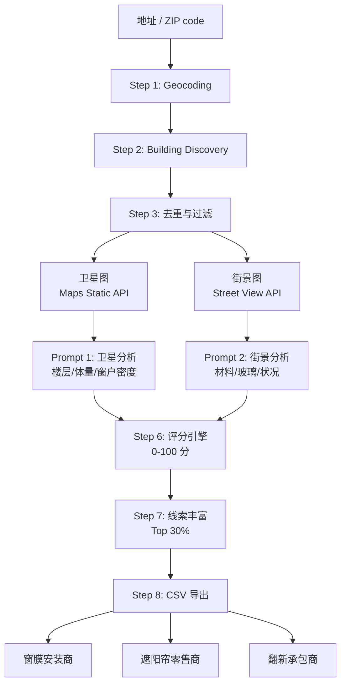

在为客户评估建筑翻新线索系统时，发现 LLM 视觉感知提取的建筑字段具有跨行业复用价值，记录完整架构设计与商业延伸逻辑。

## TL;DR

用 Google Street View + Satellite 图像喂给 LLM，提取建筑外观的结构化字段（玻璃类型、朝向、外墙材料、状况），生成翻新潜力评分。同一套 pipeline 无需修改，可直接向窗膜安装商、遮阳帘零售商输出精准线索。150 栋建筑 POC 成本约 $125。

{/* truncate */}

## Why This System

美国商业建筑翻新市场依赖人工扫街识别目标——效率低、覆盖有限。窗膜和遮阳帘行业同样缺乏基于建筑物理属性的精准获客工具。

核心洞察：建筑外观图像包含可量化的商业信号，LLM Vision 可以零样本提取这些信号，一次开发，多行业复用。

## Pipeline 设计

系统共 8 步，输入为地址或 ZIP code，输出为带评分的建筑线索 CSV。



**Step 1 — Geocoding**
Google Geocoding API 将用户输入转换为经纬度坐标。

**Step 2 — Building Discovery**
Google Places Nearby Search（半径 500m），按建筑类型过滤：办公楼、酒店、公寓、工业设施。

**Step 3 — 去重与过滤**
按 `place_id` 去重，剔除缺失 geometry 数据的结果。

**Step 4 — 双图像并行获取**
- 卫星图：Maps Static API，zoom=18，640×640px
- 街景图：Street View Static API，640×640px，fov=90
- 先调用 Street View Metadata API（免费）确认覆盖，避免无效计费

**Step 5 — LLM 视觉感知**
两个独立 Prompt（不合并——合并会降低结构化输出稳定性）：
- Prompt 1（卫星图）：楼层数、建筑体量、窗户密度
- Prompt 2（街景图）：外墙材料、玻璃类型、状况、遮挡程度

```json
{
  "material": "glass_curtain_wall / brick / concrete / mixed",
  "glass_type": "single / double / unknown",
  "condition": "good / fair / poor",
  "orientation": "N / S / E / W / mixed",
  "estimated_age": "0-10 / 10-20 / 20+ years",
  "occlusion_level": "none / minor / major",
  "confidence": "high / medium / low"
}
```

**Step 6 — 评分引擎**
固定权重规则引擎，0–100 分：

| 条件 | 加分 |
|------|------|
| glass_type = single-pane | +40 |
| material = aged (brick/concrete) | +20 |
| estimated_age > 20 years | +20 |
| condition = poor | +20 |

置信度折扣：medium × 0.8 / low × 0.6

**Step 7 — 线索丰富**
仅对评分 Top 30% 的建筑调用 Places Details API，获取名称、地址、电话、网站。

**Step 8 — CSV 导出**
完整字段输出，含空白人工标注列供人工复核。

### Street View 缺失的降级策略

建筑不丢弃，三级降级处理：

| 场景 | 处理方式 |
|------|---------|
| Street View 可用 | 完整双图分析 |
| 无 Street View 覆盖 | 仅卫星分析，material/glass 标 unknown，置信度降为 medium |
| 严重遮挡 | 同上，标记为人工复核优先样本 |

## Commercial Extension

LLM 提取的字段是通用物理属性，不绑定翻新行业。相同字段，换一套过滤条件，即可服务不同买家。

### 主要复用方向

**窗膜安装商**
目标信号：`glass_type=single` + `orientation=W/S` + `window_density=high`

单层玻璃隔热差，西/南朝向受峰值太阳辐射，窗户密度高意味着项目规模大。三个信号同时命中，窗膜安装意向极强。

**遮阳帘零售商**
目标信号：`orientation=W/S` + `window_density=high`（大落地窗 → 高客单价）

同一批高分建筑对不同行业均有价值，一条线索可同时售予非竞争性的多个买家。

### 线索流转

```
ZIP code 输入
      ↓
建筑发现 + LLM 分析
      ↓
Top 30% 高分建筑
      ↓
按行业匹配字段信号：
  • 窗膜：glass_type=single + orientation=W/S
  • 遮阳帘：orientation=W/S + window_density=high
      ↓
各行业可售线索
```

**一套 pipeline，多个行业。** 150 栋建筑 POC 扫描成本约 $125，可同时为 2 个以上行业生成线索，边际成本接近零。

## 关键设计决策

**为什么用两个独立 Prompt 而不是合并？**
合并 Prompt 在处理多图像时会降低结构化 JSON 输出的稳定性，字段缺失率上升。两个独立 Prompt 各自聚焦单一图像类型，输出更可靠。

**为什么排除 LangChain？**
系统是固定线性 pipeline，不需要动态决策。引入 Agent 框架只会增加调试复杂度，无实质收益。

**为什么不训练自定义模型？**
UCL 2024 研究证实 GPT-4 Vision 可零样本提取建筑年代信息，无需预标注。POC 阶段先验证零样本准确率基线，再决定是否需要 fine-tune。

## POC 执行计划

- **规模：** 1–2 个美国城市，各 2–3 个 ZIP code，目标 100–150 栋建筑
- **验证方式：** 人工标注 ground truth → 与 LLM 输出对比 → 计算各字段准确率
- **决策节点：** 准确率达到可接受基线后，再进入完整开发

### 估算 API 成本（150 栋建筑）

| API | 费用 |
|-----|------|
| Geocoding | ~$5 |
| Places Nearby Search | ~$10 |
| Street View Static | ~$35 |
| Maps Static (satellite) | ~$25 |
| LLM Vision | ~$50 |
| **合计** | **~$125** |

## Research References

**1. Housing Passport — World Bank (2019)**

World Bank-supported project using street view + ML to automatically identify vulnerable buildings and generate a 'Housing Passport' record for each.

- Validates technical feasibility of street view + ML for building material and condition identification
- Processing speed: ~$1.50 per 300,000 images/hour after training
- **Key difference:** that project used proprietary street imagery + custom-trained models; this system uses Google Street View + LLM Vision zero-shot (no pre-labeling required, but accuracy must be POC-validated)

**2. UCL — Zero-Shot Building Age Classification Using GPT-4 (ISPRS 2024)**

University College London research using GPT-4 Vision for zero-shot building age classification from facade images, with no labeled training data required.

- Overall accuracy: 39.69% (coarse-grained classification)
- Mean absolute error: 0.85 decades (~8–9 years)
- Confirms LLM Vision can extract building age from facade images without training
- **Glass type recognition has no published benchmark** — accuracy must be measured in POC

---
**对类似的 AI 线索生成系统感兴趣？[联系合作](/about)**
