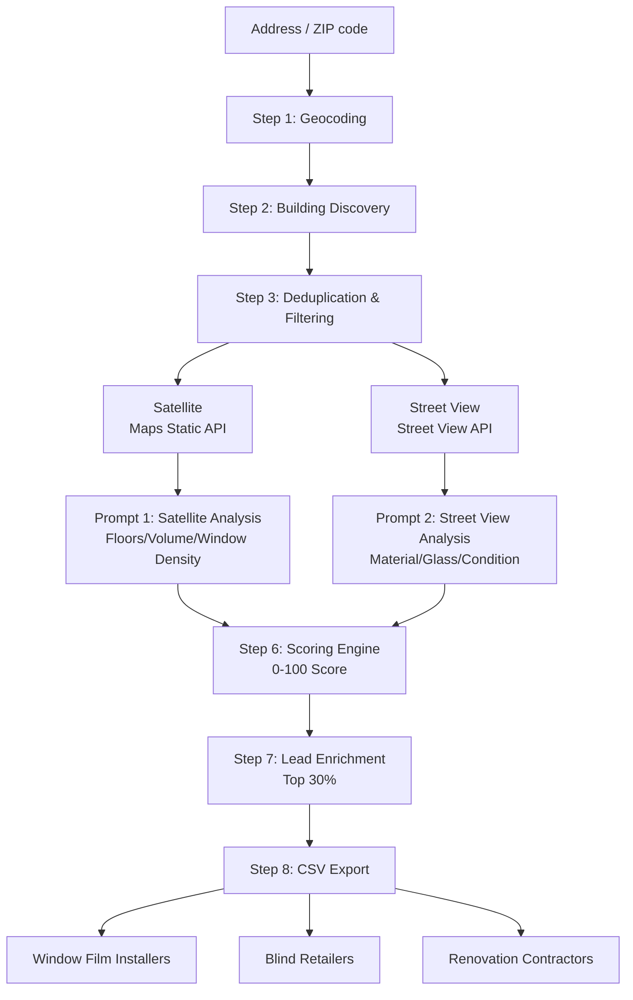

Encountered this architecture challenge while designing a building renovation lead identification system for a client. The same LLM visual pipeline proved reusable across multiple industries with zero additional development cost.

## TL;DR

Feed Google Street View + Satellite images to an LLM, extract structured building attributes (glass type, orientation, facade material, condition), and generate a renovation potential score. The same pipeline — without modification — can produce targeted leads for window film installers and window covering retailers. POC cost for 150 buildings: ~$125.

## Why This System

The US commercial building renovation market relies on manual canvassing to identify targets — low efficiency, limited coverage. The window film and solar shading industries face the same problem: no tool exists to identify high-intent buildings based on physical attributes.

Core insight: building facade images contain quantifiable commercial signals. LLM Vision can extract these signals zero-shot. Build once, reuse across industries.

## Pipeline Design

8-step pipeline. Input: address or ZIP code. Output: scored building lead CSV.



**Step 1 — Geocoding**
Google Geocoding API converts user input to lat/lng coordinates.

**Step 2 — Building Discovery**
Google Places Nearby Search (radius = 500m) with type filters: office buildings, hotels, apartments, industrial facilities.

**Step 3 — Deduplication & Filtering**
Deduplicate by `place_id`, remove results missing geometry data.

**Step 4 — Dual Image Retrieval (Parallel)**
- Satellite: Maps Static API, zoom=18, 640×640px
- Street view: Street View Static API, 640×640px, fov=90
- Street View Metadata API (free) checks coverage before requesting images — avoids unnecessary billing

**Step 5 — LLM Visual Perception**
Two separate prompts (not merged — merging reduces structured output stability):
- Prompt 1 (satellite): floor count, building volume, window density
- Prompt 2 (street view): facade material, glass type, condition, occlusion level

```json
{
  "material": "glass_curtain_wall / brick / concrete / mixed",
  "glass_type": "single / double / unknown",
  "condition": "good / fair / poor",
  "orientation": "N / S / E / W / mixed",
  "estimated_age": "0-10 / 10-20 / 20+ years",
  "occlusion_level": "none / minor / major",
  "confidence": "high / medium / low"
}
```

**Step 6 — Scoring Engine**
Fixed-weight rule engine, 0–100 score:

| Condition | Score Added |
|-----------|-------------|
| glass_type = single-pane | +40 |
| material = aged (brick/concrete) | +20 |
| estimated_age > 20 years | +20 |
| condition = poor | +20 |

Confidence discount: medium × 0.8 / low × 0.6

**Step 7 — Lead Enrichment**
Places Details API called only for top 30% scored buildings. Returns: name, address, phone, website.

**Step 8 — CSV Export**
Full field output with empty manual annotation column for human review.

### Street View Fallback Strategy

Buildings are never discarded. Three-tier graceful degradation:

| Scenario | Handling |
|----------|----------|
| Street view available | Full dual-image analysis |
| No street view coverage | Satellite-only analysis; material/glass marked unknown; confidence auto-downgraded to medium |
| Heavy occlusion | Same as above; flagged as priority manual annotation sample |

## Commercial Extension

LLM-extracted fields are generic physical attributes — not bound to the renovation use case. Same fields, different filter conditions, different buyer.

### Primary Verticals

**Window Film Installers**
Target signals: `glass_type=single` + `orientation=W/S` + `window_density=high`

Single-pane glass means poor thermal insulation. West/south-facing facades receive peak solar gain. High window density increases project scale. All three signals combined identify buildings with strong intent for window film installation.

**Window Covering / Blind Retailers**
Target signals: `orientation=W/S` + `window_density=high` (floor-to-ceiling windows → high order value)

The same high-scoring buildings are valuable to multiple non-competing buyers. One scored building can be sold as a lead to both verticals simultaneously.

### Lead Flow

```
ZIP code input
      ↓
Building discovery + LLM analysis
      ↓
Top 30% scored buildings
      ↓
Field signals matched per vertical:
  • Window film: glass_type=single + orientation=W/S
  • Window coverings: orientation=W/S + window_density=high
      ↓
Sellable leads per vertical
```

**One pipeline, multiple verticals.** A 150-building POC scan costing ~$125 can generate leads for 2+ industries simultaneously. Marginal cost per additional vertical approaches zero.

## Key Design Decisions

**Why two separate prompts instead of one merged prompt?**
Merging prompts when processing multiple images increases structured JSON instability — field omission rates rise. Two independent prompts each focus on a single image type, producing more reliable output.

**Why exclude LangChain?**
The system is a fixed linear pipeline with no dynamic decision-making. Introducing an agent framework adds debugging complexity with no real benefit.

**Why not train a custom model?**
UCL 2024 research confirms GPT-4 Vision can extract building age from facade images zero-shot, with no pre-labeling required. POC phase validates the zero-shot accuracy baseline first — fine-tuning only if needed.

## POC Execution Plan

- **Scale:** 1–2 US cities, 2–3 ZIP codes each, targeting 100–150 buildings
- **Validation:** Manual ground-truth labeling → compare with LLM output → calculate per-field accuracy
- **Decision gate:** proceed to full development only after baseline accuracy is confirmed acceptable

### Estimated API Cost — 150 Buildings

| API | Cost |
|-----|------|
| Geocoding | ~$5 |
| Places Nearby Search | ~$10 |
| Street View Static | ~$35 |
| Maps Static (satellite) | ~$25 |
| LLM Vision | ~$50 |
| **Total** | **~$125** |

## Research References

**1. Housing Passport — World Bank (2019)**

World Bank-supported project using street view + ML to automatically identify vulnerable buildings and generate a 'Housing Passport' record for each.

- Validates technical feasibility of street view + ML for building material and condition identification
- Processing speed: ~$1.50 per 300,000 images/hour after training
- **Key difference:** that project used proprietary street imagery + custom-trained models; this system uses Google Street View + LLM Vision zero-shot (no pre-labeling required, but accuracy must be POC-validated)

**2. UCL — Zero-Shot Building Age Classification Using GPT-4 (ISPRS 2024)**

University College London research using GPT-4 Vision for zero-shot building age classification from facade images, with no labeled training data required.

- Overall accuracy: 39.69% (coarse-grained classification)
- Mean absolute error: 0.85 decades (~8–9 years)
- Confirms LLM Vision can extract building age from facade images without training
- **Glass type recognition has no published benchmark** — accuracy must be measured in POC

---
**Interested in a similar AI-powered lead generation system? [Let's talk](/about)**
